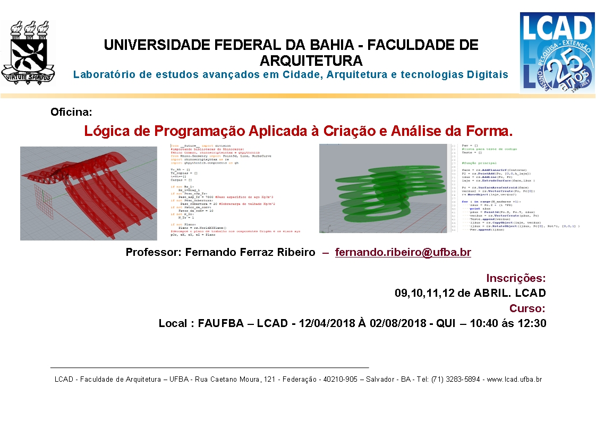

**Curso de extensão:**

**Lógica de programação aplicada à criação e análise da forma - Terceira edição 2018.1**
============================================================================================
**Cartaz Divulgação:**

**Objetivo:**

Introduzir os conceitos básicos de lógica de programação e sua aplicação na criação e análise de formas.

**Publico alvo:**

Profissionais e estudantes nas área de Arquitetura, Engenharia, Design de produtos, Computação, dentre outros.

**Pré-requisitos:**

Ter conhecimento de uma ferramenta CAD 3D.

**Principais ferramentas:**

Python (CPython 2.7 idle), Rhinoceros 5, Grasshopper, Grasshopper Python Component.

**período:**
12/04/2018 À 02/08/2018
**Horário:**
quintas  – 10:40 ás 12:30 (34 horas total)

**Inscrições:**

Dias 09,10,11,12 de Abril* no Lcad - Faculdade de Arquitetura - UFBA

*ou até o preenchimento das vagas.

**Vagas:**

20

**Download da ficha de inscrição:**

[Ficha de inscrição](https://github.com/255ribeiro/LPACAF/blob/master/Ficha_de_inscricao/LPACAF_inscricao_2018_1.doc)

<a href="LPACAF_inscricao_2018_1.doc" download> Ficha de inscrição - Download</a>

**Professor:**
Fernando Ferraz Ribeiro
**Informações:**
fernando.ribeiro@ufba.br

**Resumo:**

O desenvolvimento da Ciência da Computação, e a sua consequente aplicação em ambientes digitais de projeto, acarretaram em grandes mudanças na atuação de diversos profissionais que lidam com a criação de formas e objetos. As metodologias generativas, a concepção de formas complexas, a visualização de dados urbanísticos ou a manipulação avançada de informações construtivas de um modelo, por exemplo, exigem por vezes um domínio da lógica de programação que pode ser prescindido pelo usuário da interface básica.

Este curso pretende introduzir a lógica de programação como uma estratégia para a resolução de certos tipos de problema. A conexão com a prática profissional será dada através da aplicação direta da lógica na manipulação de formas nas interfaces de programação dos aplicativos (API) de ferramentas CAD.
