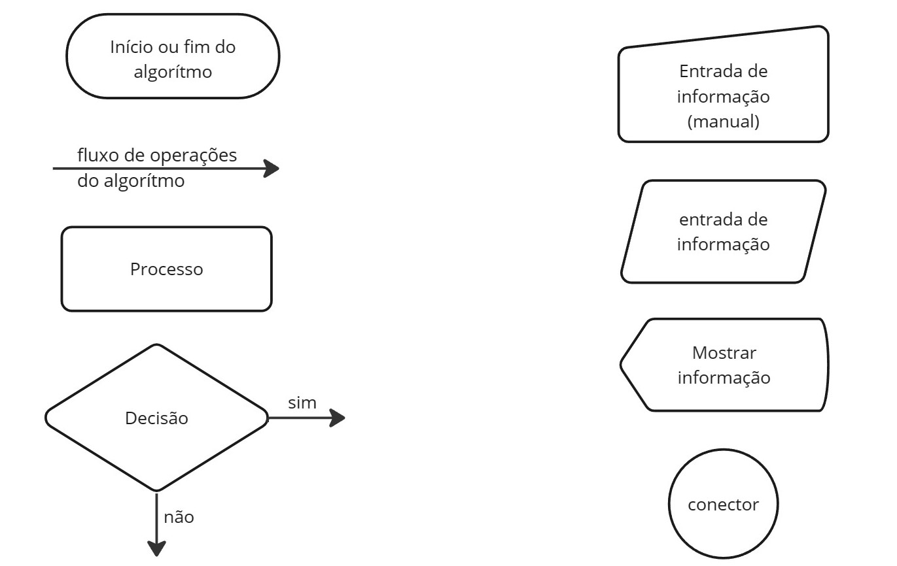

# Fluxogramas

## Definição

"Fluxograma: é um tipo de diagrama, e pode ser entendido como uma representação esquemática de um processo ou algoritmo, muitas vezes feito através de gráficos que ilustram de forma descomplicada a transição de informações entre os elementos que o compõem, ou seja, é a sequência operacional do desenvolvimento de um processo, o qual caracteriza: o trabalho que está sendo realizado, o tempo necessário para sua realização, a distância percorrida pelos documentos, quem está realizando o trabalho e como ele flui entre os participantes deste processo."

[https://pt.wikipedia.org/wiki/Fluxograma](https://pt.wikipedia.org/wiki/Fluxograma)

[https://www.lucidchart.com/pages/pt/o-que-e-um-fluxograma](https://www.lucidchart.com/pages/pt/o-que-e-um-fluxograma)

## Representando um algortimo como um fluxograma

### Alguns símbolos utilizados na representação de um fluxograma.

## Editores de fluxogramas gratuitos

Praticamente todo programa gráfico pode editar um fluxograma. Seguem abaixo algumas sugestões de programas gratuitos.

### Online
 
- [https://miro.com/](https://miro.com/)

- [https://www.lucidchart.com/pages/pt](https://www.lucidchart.com/pages/pt)

- [draw.io](https://app.diagrams.net/)

- [https://creately.com/](https://creately.com/)

### Desktop

- [Papyrus](https://eclipse.dev/papyrus/download.html)
  
- [Inkscape](https://inkscape.org/)