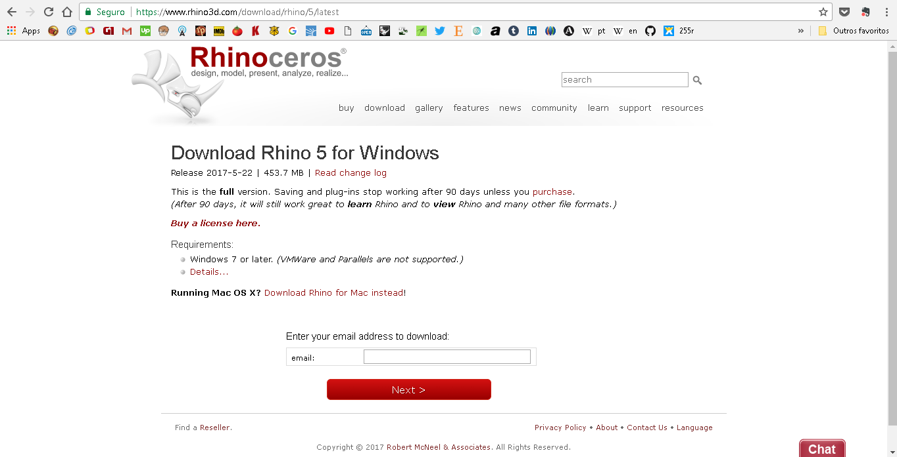
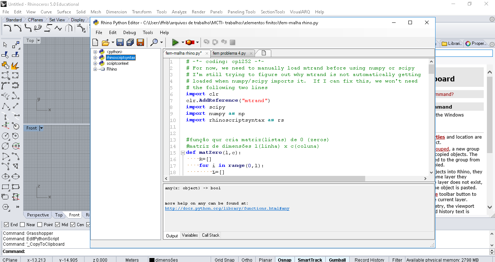
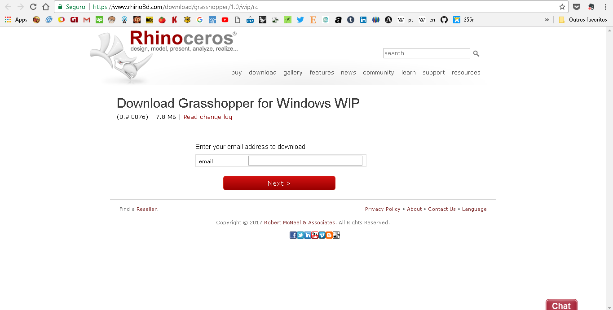

# Instalação do Ambiente de Trabalho
### Rhino, Grasshopper, Grasshopper Python Component

1. Baixar o instalador da versão de Avaliação do Rhinoceros no site [www.rhino3d.com](www.rhino3d.com)

   -  [Link direto para a página de download](www.rhino3d.com/download/rhino/5/latest)
   
   
      

      - Informe seu e-mail e clique em next;
      
      - Salve o instalador e execute;
      
      - Siga as instruções de instalação;
    
      - Com  o Rhino instalado é possível editar e rodar código em Python. Na linha de comando digite *EditPythonScript*, ou pelos menus procure por Tools -> Python Script -> Edit.
       
      
          
      
1. Baixar o Grasshopper no site [http://www.grasshopper3d.com/](http://www.grasshopper3d.com/)
   
   - [Link direto para a página de download](https://www.rhino3d.com/download/grasshopper/1.0/wip/rc)
   
   
    
    
    
      - Informe seu e-mail e clique em next;
      
      - salve o instalador;
      
      - feche o Rhinoceros;
      
      - execute o instalador e siga as instruções de instalação;
      
      - abra o rhinoceros;
    
      - Com  o Grasshopper instalado é possível editar algoritmos no ambiente gráfico. Na linha de comando digite *Grasshopper*
      
      
    
