# Instalação do Ambiente de Trabalho
### Rhino, Grasshopper, Grasshopper Python Component

### 1. Baixar o instalador da versão de Avaliação do **Rhinoceros** no site [rhino3d.com](www.rhino3d.com)

Link direto para a página de download do [**Rhinoceros 5**](www.rhino3d.com/download/rhino/5/latest)

* Informe seu e-mail e clique em *next*;

* Salve o instalador e execute;

* Siga as instruções de instalação;

* Com  o **Rhinoceros** instalado é possível editar e rodar código em Python. Na linha de comando digite:

    EditPythonScript

ou, utilizando o menu, procure por **Tools -> Python Script -> Edit**.

### 2. Baixar o **Grasshopper** no site [grasshopper3d.com](http://www.grasshopper3d.com/)

   - Link direto para a página de download do [Graasshopper](https://www.rhino3d.com/download/grasshopper/1.0/wip/rc)

* Informe seu e-mail e clique em **next**;

* salve o instalador;

* feche o **Rhinoceros**;

* execute o instalador e siga as instruções de instalação;

* abra o **Rhinoceros**;

* Com  o **Grasshopper** instalado é possível editar algoritmos no ambiente gráfico. Na linha de comando digite:

    Grasshopper

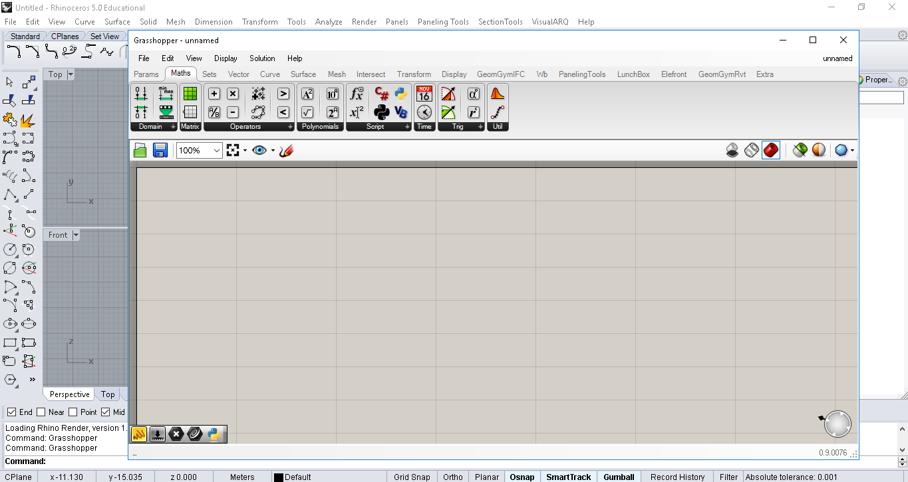

### 3. Baixar o **Grasshopper Python Component** (**GHPYTHON**) no site [food4rhino.com](www.food4rhino.com)

* É necessário registrar-se no site

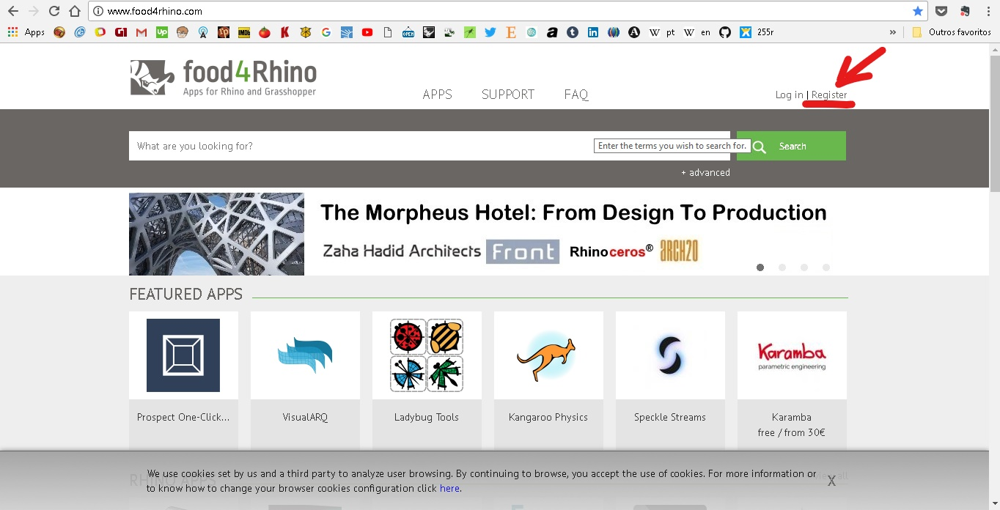

* Após o registro, na página inicial do site, pesquise por **GHPYTHON**

 [Link direto para a página de download do *GHPYTHON* ](http://www.food4rhino.com/app/ghpython#downloads_list)

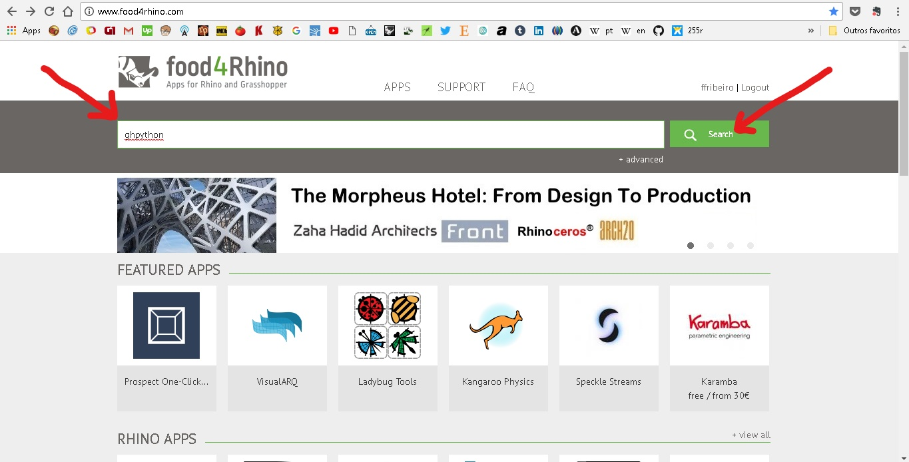

* Na página do **GHPYTHON** aparece um botão de **download** perto do topo. Este botão corre a página para baixo mostrando a lista de versões do componente para download.

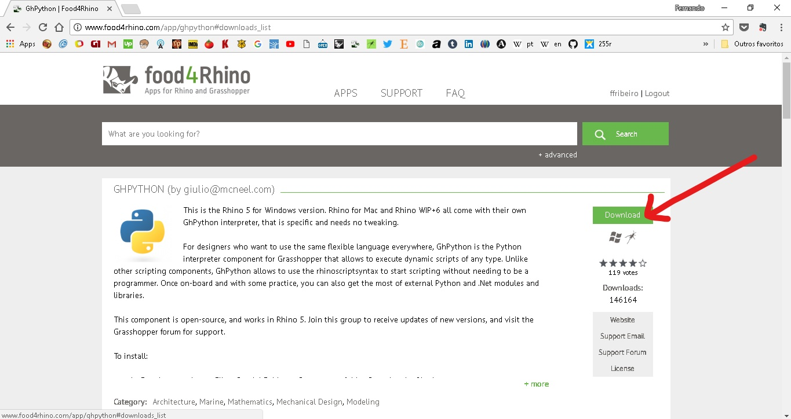

* Na lista de versões, escolha a primeira versão.

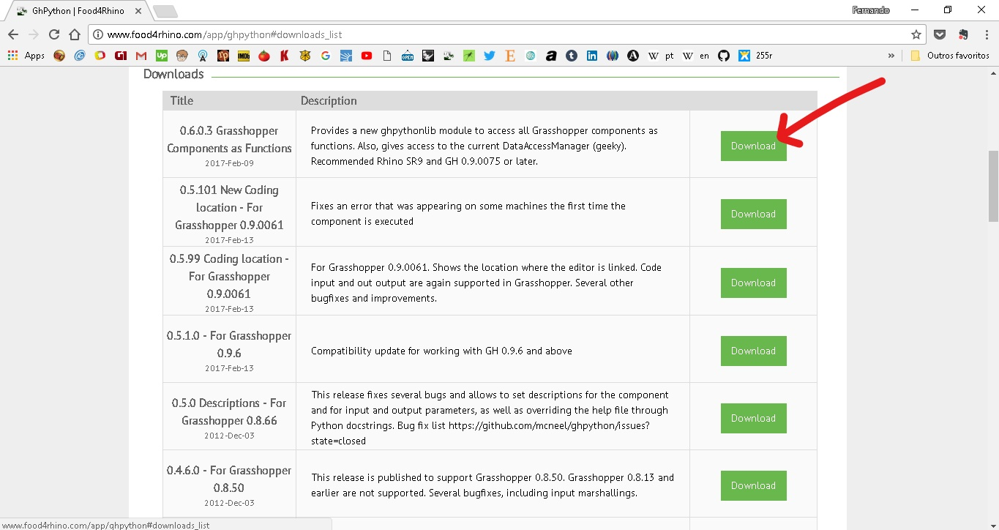

* Se o download não começar, verifique se o seu navegador está bloqueando pop-ups. No Google Chrome o aviso de boqueio fica à direita do endereço do site.

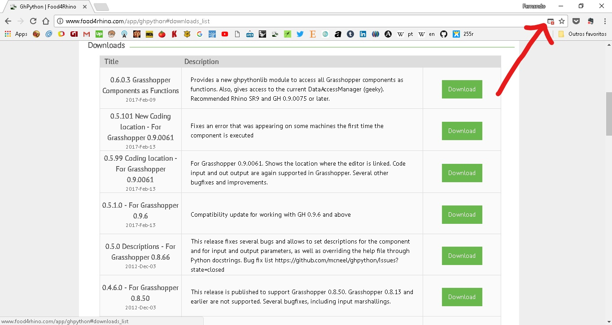

* Clique no ícone do aviso de bloqueio e escolha abrir o endereço, ou desbloqueie os pop-ups para o site [Food4Rhino.com](www.food4rhino.com) e clique em concluir.

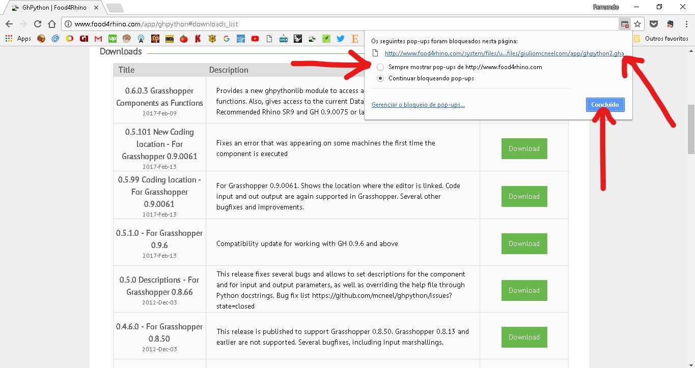

* Baixe o arquivo **ghpython2.gha** em seu computador

* Na tela do **Grasshopper**, abra o menu **File -> Special Folders -> Components Folder**.

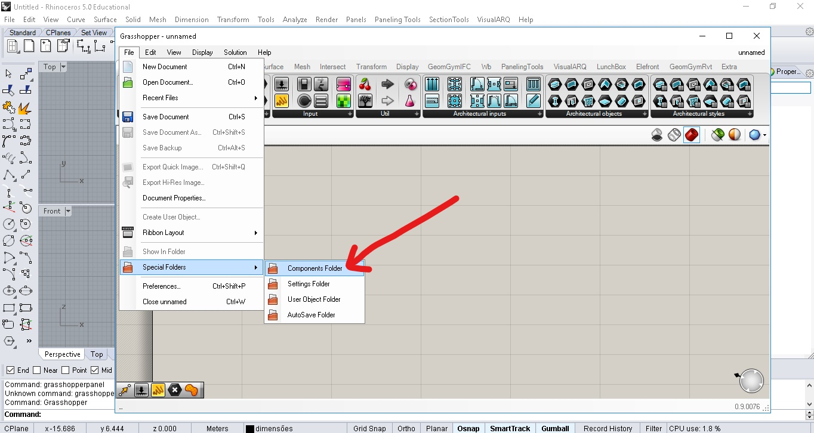

* Esse atalho serve para abrir a pasta onde são instalados as extensões (plug-ins) do **Grasshopper**, a pasta **Libraries**;

* a pasta pode estar vazia , caso nenhuma extensão tenha sido instalada no seu computador, ou pode conter muitos arquivos;

* mova ou copie o arquivo **ghpython2.gha** para a pasta de extensões (**Libraries**);

* clique com o botão direito no arquivo **ghpython2.gha**;

* selecione **Propriedades**;

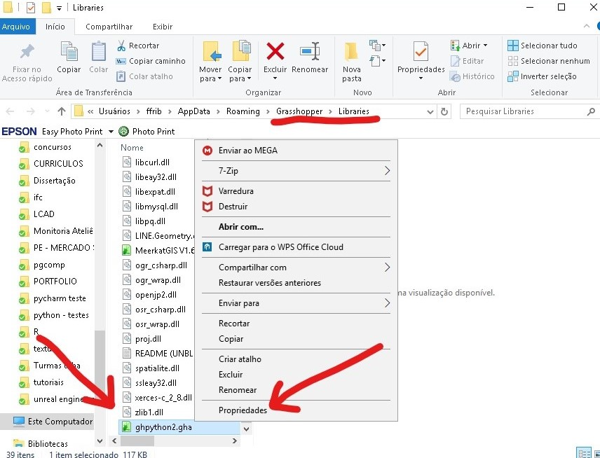

* clique na caixa **Desbloquear** e aplique as alterações;

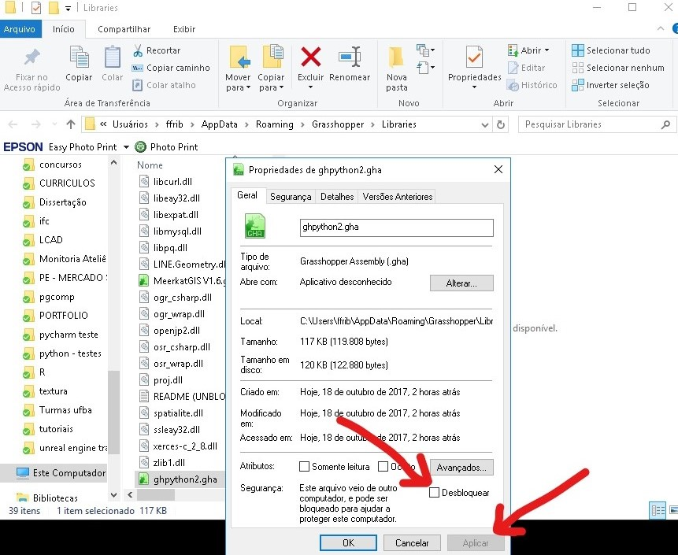

* reinicie o **Grasshopper** e o **Rhinoceros**;

* o componente **GHPYTHON** foi adicionado á aba **Math**, painel **Script**, componente **Python Script**

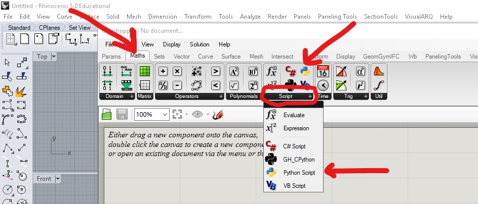

* FIM.
